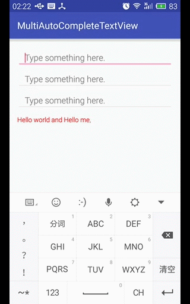

## MultiAutoCompleteTextView

`MultiAutoCompleteTextView`通过分词器`Tokenizer`，可以支持连续提示。即第一次点击提示信息后，会自动在后面添加分隔符(默认为逗号，并加上空格)，然后又可以继续显示提示信息。

#### 使用默认逗号分词器CommaTokenizer

`MultiAutoCompleteTextView`的使用与`AutoCompleteTextView`差不多，使用创建并设置`ArrayAdapter`数据适配器，然后设置触发提示的最少输入字符数，最后需要设置定义在其内部中的默认分词器`CommaTokenizer`即可。

```java
private void setupCommaTokenizerTextView() {
    String[] mOnePieceCnArray = getResources().getStringArray(R.array.onepiece_cn);
    ArrayAdapter<String> adapter = new ArrayAdapter<>(this, android.R.layout.simple_dropdown_item_1line, mOnePieceCnArray);
    mCommaTokenizerTv = (MultiAutoCompleteTextView) findViewById(R.id.tv_comma);
    mCommaTokenizerTv.setAdapter(adapter);      // 设置数据适配器
    mCommaTokenizerTv.setThreshold(1);          // 设置触发提示阈值
    mCommaTokenizerTv.setTokenizer(new MultiAutoCompleteTextView.CommaTokenizer());  // 设置分词器，默认为逗号+空格
}
```

效果如下：




#### 自定义分词器ShellTokenizer

首先CommaTokenizer是定义在MultiAutoCompleteTextView中的内部public类，实现了Tokenizer接口中的三个方法：

**findTokenStart()** - 用于查找当前光标位置之前的分隔符的位置并返回

**findTokenEnd()** - 用于查找当前光标位置之后的分隔符的位置并返回

**terminateToken()** - 用于返回提示信息加上分隔符后的文本内容

CommaTokenizer源代码注释分析如下：

```java
public static class CommaTokenizer implements Tokenizer {
    // 用于查找当前光标位置之前的分隔符的位置并返回，向前查询 
    // text - 用户已经输入的文本内容
    // cursor - 当前光标的位置，在文本内容后面
    public int findTokenStart(CharSequence text, int cursor) {
        int i = cursor;

        // 查找当前光标的前一个位置非','的字符位置
        while (i > 0 && text.charAt(i - 1) != ',') {
            i--;
        }
        // 查找','后面非空格的字符位置
        while (i < cursor && text.charAt(i) == ' ') {
            i++;
        }

        return i;   // 返回一个要加分隔符的字符串的开始位置
    }

    // 用于查找当前光标位置之后的分隔符的位置并返回，向后查询
    // text - 用户已经输入的文本内容
    // cursor - 当前光标的位置，在文本内容之间
    public int findTokenEnd(CharSequence text, int cursor) {
        int i = cursor;
        int len = text.length();

        // 向后查找','字符，若找到则直接返回其所在位置
        while (i < len) {       
            if (text.charAt(i) == ',') {    
                return i;
            } else {
                i++;
            }
        }

        return len;
    }

    // 用于返回提示信息加上分隔符后的文本内容
    // text - 提示信息中的文本内容
    public CharSequence terminateToken(CharSequence text) {
        int i = text.length();

        // 去掉原始匹配的数据的末尾空格
        while (i > 0 && text.charAt(i - 1) == ' ') {
            i--;
        }

        // // 判断原始匹配的数据去掉末尾空格后是否含有逗号，有则立即返回
        if (i > 0 && text.charAt(i - 1) == ',') {
            return text;
        } else {
            // CharSequence类型的数据有可能是富文本SpannableString类型
            // 故需要进行判断
            if (text instanceof Spanned) {
                // 创建一个新的SpannableString，传进来的text会被退化成String，
                // 导致sp中丢失掉了text中的样式配置
                SpannableString sp = new SpannableString(text + ", ");
                // 故需要借助TextUtils.copySpansFrom从text中复制原来的样式到新的sp中，
                // 以保持原先样式不变情况下添加一个逗号和空格
                TextUtils.copySpansFrom((Spanned) text, 0, text.length(),
                                        Object.class, sp, 0);
                return sp;
            } else {        // text为纯文本，直接加上逗号和空格
                return text + ", ";
            }
        }
    }
}
```

通过以上的CommaTokenizer源码分析，下面就可以自定义一个分词器ShellTokenizer，可以外部指定分隔符，源码如下：

```java
// This simple Tokenizer can be used for lists where the items are
// separated by a hyphen.
public class ShellTokenizer implements MultiAutoCompleteTextView.Tokenizer {

    private Context context;
    private static int count;
    private char tokenChar;
    private boolean isOnlyToken;

    public ShellTokenizer(Context context) {
        this(context, ',', false);
    }

    public ShellTokenizer(Context context, char tokenChar, boolean isOnlyToken) {
        this.context = context;
        this.tokenChar = tokenChar;
        this.isOnlyToken = isOnlyToken;
        count = 0;
    }

    // Returns the start of the token that ends at offset cursor within text.
    // 5 findTokenStart: Italy, ger, 10     // 每当输入一个字符后就会调用5次
    // findTokenStart: Italy, I, 8, 7       //
    // findTokenStart: Italy, It, 9, 7       //
    @Override
    public int findTokenStart(CharSequence text, int cursor) {
        int i = cursor;

        while (i > 0 && text.charAt(i - 1) != tokenChar) {  // 测试当前光标的前一个位置非','的字符位置
            i--;
        }
        while (i < cursor && text.charAt(i) == ' ') {       // 测试','后面非空格的字符位置
            i++;
        }

        count++;
        Toast.makeText(context, count + " findTokenStart: " + text + ", " + cursor + ", " + i, Toast.LENGTH_SHORT).show();
        return i;       // 返回一个要加分隔符的字符串的开始位置
    }

    // Returns the end of the token (minus trailing punctuation)
    // that begins at offset cursor within text.
    @Override
    public int findTokenEnd(CharSequence text, int cursor) {
        Toast.makeText(context, "findTokenEnd: " + text + ", " + cursor, Toast.LENGTH_SHORT).show();
        int i = cursor;
        int len = text.length();

        while (i < len) {
            if (text.charAt(i) == tokenChar) {
                return i;
            } else {
                i++;
            }
        }

        return len;
    }

    // Returns text, modified, if necessary, to ensure that
    // it ends with a token terminator (for example a space or comma).
    // terminateToken: Italy    // 输入I点击提示信息Italy时被调用，在这之前会调用一次findTokenStart()
    // 回调terminateToken()方法时，传入的text是原始的数据 (CharSequence类型的数据有可能是富文本SpannableString)
    @Override
    public CharSequence terminateToken(CharSequence text) {
        Toast.makeText(context, "terminateToken: " + text, Toast.LENGTH_SHORT).show();
        int i = text.length();

        while (i > 0 && text.charAt(i - 1) == ' ') {    // 去掉原始匹配的数据的末尾空格
            i--;
        }

        if (i > 0 && text.charAt(i - 1) == tokenChar) {       // 判断原始匹配的数据去掉末尾空格后是否含有逗号，有则立即返回
            Toast.makeText(context, "direct return: " + text, Toast.LENGTH_SHORT).show();
            return text;
        } else {

            String result = text + String.valueOf(tokenChar);
            if (!isOnlyToken) {
                result += " ";
            }

            if (text instanceof Spanned) {      // 富文本
                Toast.makeText(context, "Rich Text", Toast.LENGTH_SHORT).show();

                // 创建一个新的SpannableString，传进来的text会被退化成String，导致sp中丢失掉了text中的样式配置
                SpannableString sp = new SpannableString(result);

                // 故需要借助TextUtils.copySpansFrom从text中复制原来的样式到新的sp中，以保持原先样式不变情况下添加一个逗号和空格
                TextUtils.copySpansFrom((Spanned) text, 0, text.length(), Object.class, sp, 0);

                return sp;
            } else {
                Toast.makeText(context, "Plain Text", Toast.LENGTH_SHORT).show();   // Plaint Text +
                return result;     // 66Italy, 66
            }
        }
    }
}
```

自定义分词器ShellTokenizer的使用：

```java
private void setupShellTokenizerTextView() {
    String[] mOnePieceArray = getResources().getStringArray(R.array.onepiece);
    ArrayAdapter<String> adapter = new ArrayAdapter<>(this, android.R.layout.simple_dropdown_item_1line, mOnePieceArray);
    mShellTokenizerTv = (MultiAutoCompleteTextView) findViewById(R.id.tv_shell);
    mShellTokenizerTv.setAdapter(adapter);
    mShellTokenizerTv.setThreshold(1);
    mShellTokenizerTv.setTokenizer(new ShellTokenizer(this, '-', true));    // 只有分词符，不额外加空格
}
```

效果如下：


#### 自定义邮箱域名提示控件

使用`MultiAutoCompleteTextView`在指定字符后产生提示信息列表功能来自定义一个邮箱域名提示的控件`MailBoxAutoCompleteTextView`，其直接继承自MultiAutoCompleteTextView，只要重写`enoughToFilter()`方法即可。

```java
// 执行流程猜想：
// 0. 每当用户输入一个字符或者删除一个字符时都会触发enoughToFilter()方法，进行判断是否包含'@'字符且不是第一个字符位置
// 1. 如当用户输入最后一个字符为'@'即"hello@"时，enoughToFilter()方法测试成功返回true，将触发Tokenizer.findTokenStart()方法，
//    返回当前光标所在位置，故得到的过滤后的提示信息将为全部的数据信息
// 2. 当用户再次输入如"hello@1"时，enoughToFilter()方法测试成功返回true，将触发Tokenizer.findTokenStart()方法，
//    '@'后面的字符串的开始位置，故得到的过滤后的提示信息将为以"1"开头的数据信息 (hello@1, 7, 6)
// 3. 当用户点击提示信息"163.com"时，会调用Tokenizer.findTokenStart()方法得到 (hello@1, 7, 6) 6的开始位置，
//    然后将以6开始的后面的字符串替换成"163.com"，完成邮箱后缀的自定补全
public class MailBoxAutoCompleteTextView extends MultiAutoCompleteTextView {

    private Context context;

    public MailBoxAutoCompleteTextView(Context context) {
        this(context, null);
    }

    public MailBoxAutoCompleteTextView(Context context, AttributeSet attrs) {
        super(context, attrs);
        this.context = context;
    }

    // 当输入@符号时，就会去调用Tokenizer.findTokenStart()方法一次
    // 当点击下拉提示框中的某个信息时，会再次调用Tokenizer.findTokenStart()方法一次，然后再调用terminateToken()方法一次
    @Override
    public boolean enoughToFilter() {
        String text = getText().toString();
        // 若用户输入的文本字符串中包含'@'字符且不在第一位，则满足条件返回true，否则返回false
        return text.contains("@") && text.indexOf("@") > 0;
    }
}
```

自定义用于邮箱域名提示功能的分词器`MailBoxTokenizer`

```java
public class MailBoxTokenizer implements MultiAutoCompleteTextView.Tokenizer {
    public int findTokenStart(CharSequence text, int cursor) {
        int i = cursor;

        while (i > 0 && text.charAt(i - 1) != '@') {
            i--;
        }
        return i;
    }

    public int findTokenEnd(CharSequence text, int cursor) {
        int i = cursor;
        int len = text.length();

        while (i < len) {
            if (text.charAt(i) == '@') {
                return i;
            } else {
                i++;
            }
        }

        return len;
    }
    
    // 由于邮箱注册信息一般为纯文本内容，这里就不再进行富文本处理，直接返回
    public CharSequence terminateToken(CharSequence text) {
        return text;
    }
}
```

自定义邮箱域名提示控件`MailBoxAutoCompleteTextView`的使用：

```xml
<com.shellever.multiautocompletetextview.MailBoxAutoCompleteTextView
    android:id="@+id/tv_mail_box"
    android:layout_width="match_parent"
    android:layout_height="wrap_content"
    android:hint="@string/text_hint" />
```

```java
private void setupMailboxTokenizerTextView() {
    String[] mMailboxPostfixArray = getResources().getStringArray(R.array.mail_box_postfix);
    ArrayAdapter<String> adapter = new ArrayAdapter<>(this, android.R.layout.simple_list_item_1, mMailboxPostfixArray);
    mMailboxTokenizerTv = (MultiAutoCompleteTextView) findViewById(R.id.tv_mail_box);
    mMailboxTokenizerTv.setAdapter(adapter);
    mMailboxTokenizerTv.setThreshold(1);    // 因重写enoughToFilter()方法，故threshold设置已没有意义
    mMailboxTokenizerTv.setDropDownHeight(dp2px(200));     // 设置自动提示列表的高度为200dp
    mMailboxTokenizerTv.setTokenizer(new MailBoxTokenizer());
}

private int dp2px(int dip){
    DisplayMetrics dm = getResources().getDisplayMetrics();
    return (int) TypedValue.applyDimension(TypedValue.COMPLEX_UNIT_DIP, dip, dm);
}
```

效果如下：


## Contacts

**Blog: [shellever](http://www.jianshu.com/users/22e9a407c7c1/latest_articles)**

**Email: shellever@163.com**

**Enjoy yourself!**